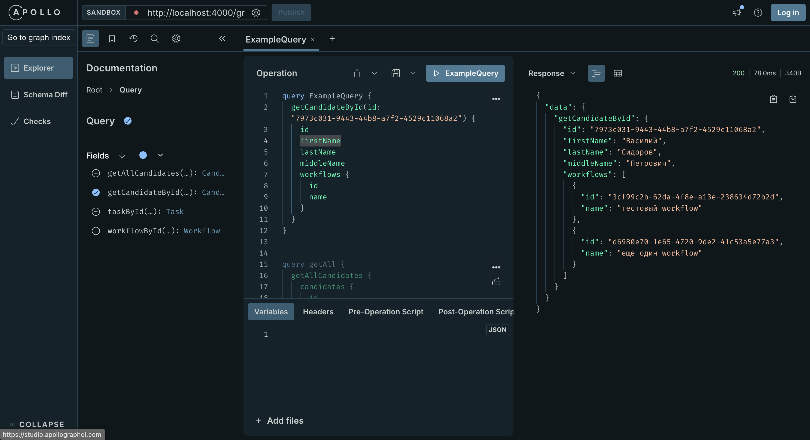
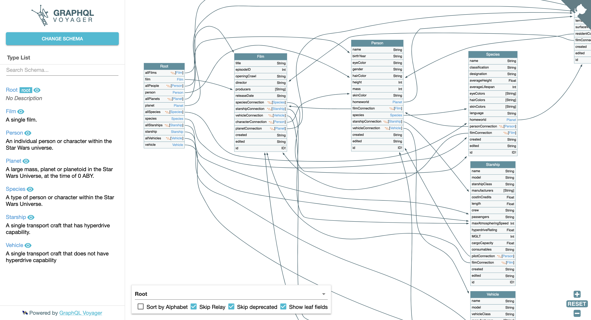

### Apollo Gateway and GraphQL Voyager

Локальный запуск:
```bash
npm install
node gateway.js
```
Output:
```
> 🚀 Apollo Server ready at http://localhost:4000/graphql
> 🚀 GraphQL Voyager ready at http://localhost:4000/voyager
```

### Apollo Gateway
Единая точка входа в бекенд на graphql, собирает со всех сервисов единую супер-схему


### GraphQL Voyager 
на основе суперсхемы рисует ER диаграмму взаимосвязей всех сущностей во всех сервисах, учитывая федеративные типы Apollo Federation.
Пример ER-схемы voyager:
